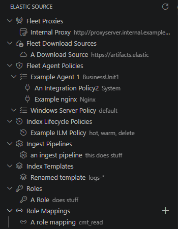

# Elastic Source Manager

A VS Code extension for managing Elastic Cloud / Elasticsearch run-time artifacts as
infrastructure-as-code — without needing to hand-edit the JSON payloads for every API.

It gives you a design-time experience roughly equivalent to managing a deployment via
Click-Ops in Kibana, but backed by plain JSON files you can commit, diff, and review like any
other code.

## What it does

- Adds an **Elastic Source** view to the Activity Bar, backed by the VS Code
  [Tree View API](https://code.visualstudio.com/api/extension-guides/tree-view). The tree has
  two top-level nodes: **Project**, with every file-backed artifact type nested underneath as
  a category with its saved instances, and **Connections** (see below).
- Selecting an artifact opens a **structured editor** (a webview form) instead of the raw
  JSON file — fields, dropdowns, checkboxes and repeatable rows map directly onto the shape
  of the corresponding Elasticsearch/Fleet API. Genuinely open-ended sub-structures (Query
  DSL filters, role-mapping rule trees, arbitrary metadata) are left as validated JSON
  editors rather than being force-fit into a rigid form.
- Saves land as `.json` files under a configurable project root, named after the artifact
  itself, ready to be applied to a real deployment by whatever tooling/pipeline you use for
  that (this extension only manages the source-of-truth files, it does not call the
  Elasticsearch/Fleet APIs itself for any of these artifact types).
- The one exception is the **Connections** category: register an Elastic Cloud deployment
  (Cloud ID + API Key) to browse its *live* data. The API key is stored in VS Code's
  [SecretStorage](https://code.visualstudio.com/api/references/vscode-api#SecretStorage) -
  never written to disk - and is used to fetch that deployment's Kibana Spaces, and its Fleet
  Agent Policies per Kibana Space (each agent policy with its assigned Integration Policies
  nested underneath), on demand, shown read-only under the connection in the tree.



## Supported artifact types

All artifacts live under a single project root folder (`Elastic_Source` by default, see
[Configuration](#configuration)):

| Folder | Artifact | API reference |
| --- | --- | --- |
| `Fleet_Proxies/` | Fleet proxy servers | — |
| `Fleet_Download_Sources/` | Fleet artifact download sources | — |
| `Fleet_Agent_Policies/<name>/<name>.json` | Fleet Agent Policies | [Create Agent Policies](https://www.elastic.co/docs/api/doc/serverless/operation/operation-post-fleet-agent-policies) |
| `Fleet_Agent_Policies/<name>/Integrations/*.json` | Integration Policies - 14 (package, version) pairs across System, Nginx, Apache, APM, MySQL, Custom Logs (Filestream), PHP-FPM, Prometheus, Custom Logs (Deprecated) and PostgreSQL; see [`claude.md`](claude.md) for the full table | [Elastic Package Registry](https://epr.elastic.co) package manifests |
| `Index_Lifecycle_Policies/` | ILM Policies | [Put Lifecycle](https://www.elastic.co/docs/api/doc/elasticsearch/operation/operation-ilm-put-lifecycle) |
| `Ingest_Pipelines/` | Ingest Pipelines | [Put Pipeline](https://www.elastic.co/docs/api/doc/elasticsearch/operation/operation-ingest-put-pipeline) |
| `Index_Templates/` | Index Templates | [Put Index Template](https://www.elastic.co/docs/api/doc/elasticsearch/operation/operation-indices-put-index-template) |
| `Roles/` | Security Roles | [Put Role](https://www.elastic.co/docs/api/doc/elasticsearch/operation/operation-security-put-role) |
| `Role_Mappings/` | Security Role Mappings | [Put Role Mapping](https://www.elastic.co/docs/api/doc/elasticsearch/operation/operation-security-put-role-mapping) |
| `Spaces/` | Kibana Spaces | [Create Space](https://www.elastic.co/docs/api/doc/kibana/operation/operation-post-spaces-space) |
| `SnapshotPolicies/` | Snapshot Lifecycle Management Policies | [Put Snapshot Lifecycle Policy](https://www.elastic.co/docs/api/doc/elasticsearch/operation/operation-slm-put-lifecycle) |
| `Connections/` | Elastic Cloud connections (non-secret metadata only - see below) | — |

Each JSON file is named after the artifact's own `name` (or, for Agent Policies, the owning
folder name too) and maps directly onto the request body of the linked API, with `name`
added at the top level since most of these APIs take the name from the URL path rather than
the body.

### Connections

Unlike the artifact types above, a Connection isn't applied to a deployment - it's a record
*this extension* uses to talk to one. Its JSON file only ever holds non-secret metadata
(`id`, `name`, `cloudId`); the API key you enter is stored in VS Code's SecretStorage, keyed
by the connection's `id`, and is never written to the file. Expanding a connection in the
tree shows two live nodes, each fetched from that deployment on expand and shown read-only -
none of it is saved locally unless you explicitly download it:
- **Spaces**, via Kibana's
  [Get All Spaces](https://www.elastic.co/docs/api/doc/kibana/operation/operation-get-spaces-space) API.
- **Fleet Agent Policies** - expands first into one node per Kibana Space (the same list the
  Spaces node above fetches), since a Fleet Agent Policy isn't confined to a single space and
  the same policy can appear under more than one. Expanding a space fetches that space's Agent
  Policies via Kibana's
  [Get Agent Policies](https://www.elastic.co/docs/api/doc/kibana/operation/operation-get-fleet-agent-policies)
  API, scoped to it using Kibana's space-aware URL convention (`/s/<space_id>/...`) - the
  "default" space uses the plain, unprefixed endpoint. Expanding a space also fetches that
  deployment's Integration Policies for it via the
  [Get Package Policies](https://www.elastic.co/docs/api/doc/kibana/operation/operation-get-fleet-package-policies)
  API - concurrently with the agent policies, so neither request blocks the other - and assigns
  each one to the agent policy/policies it belongs to within that space (matching Fleet's own
  `policy_id`/`policy_ids` fields), nesting them as expandable children under their owning agent
  policy. Opening one of these Integration Policies shows a read-only structured view - the same
  input/stream/var screen the editable form uses, rendered by the same client-side code, just
  with every control disabled and no Save button, for a consistent look between viewing a live
  policy and editing a downloaded one.

Each live Space, Fleet Agent Policy or Integration Policy has a **Download to Project** action
that saves it as a normal local artifact under `Spaces/`/`Fleet_Agent_Policies/`/
`Fleet_Agent_Policies/<name>/Integrations/` - the one place data flows from a live deployment
back into the project instead of the other way around. If a local artifact with that id/name
already exists, you'll be asked to confirm before it's overwritten. Downloading an Integration
Policy specifically requires its owning Fleet Agent Policy to already have been downloaded to
the project first (so there's a local folder for it to nest under) - you'll be warned if it
hasn't been.

See [`claude.md`](claude.md) for the full field-by-field breakdown of every artifact type,
including which fields are curated into structured controls vs. left as JSON escape hatches
and why.

## Requirements

- [Node.js](https://nodejs.org/) (LTS) and npm
- VS Code `^1.85.0` or later

If you're setting up a fresh machine, see [`Prerequisites.md`](Prerequisites.md) for
installing `nvm`/Node and the Yeoman VS Code extension generator.

## Getting started

1. Install dependencies:
   ```bash
   npm install
   ```
2. Open this folder in VS Code and press `F5` (or **Run and Debug → Run Extension**) to
   launch an Extension Development Host with the extension loaded.
3. In that host window, open a folder to act as your workspace, then use the **Elastic
   Source** icon in the Activity Bar to browse/create artifacts. An `Elastic_Source` folder
   (or whatever you've configured, see below) will be created on first save.

## Configuration

| Setting | Default | Description |
| --- | --- | --- |
| `elasticSource.rootFolder` | `Elastic_Source` | Path, relative to the workspace root, of the project folder containing all artifact subfolders. |
| `elasticSource.agentPolicyNamePattern` | `(.*)\s\|\s.*` | Regex applied to a live Fleet Agent Policy's or Integration Policy's name when using **Download to Project** - capture group 1 becomes the downloaded artifact's name. The default strips a trailing `\| <environment>` suffix, e.g. `Agent Policy1 \| Test` downloads as `Agent Policy1`, and `system-datatech-datacentral \| test` downloads as `system-datatech-datacentral`. If the pattern doesn't match, the full live name is used unchanged. |

## Development

```bash
npm run compile       # tsc -p ./
npm run watch         # tsc -watch -p ./
npm test              # run the Jest unit test suite
npm run test:coverage # run tests with a coverage report
```

This project maintains 100% statement/branch/function/line coverage on every file under
`src/`, including the webview editor panels (via a mocked `vscode` module and a fake
webview message handshake in `test/`).

## Packaging

```bash
npm run package
```

This runs `vsce package`, producing an installable `elastic-source-manager-<version>.vsix`
in the project root. Install it via the Extensions view's **Install from VSIX...** command,
or:

```bash
code --install-extension elastic-source-manager-<version>.vsix
```

## License

[BSD 3-Clause](LICENSE)
